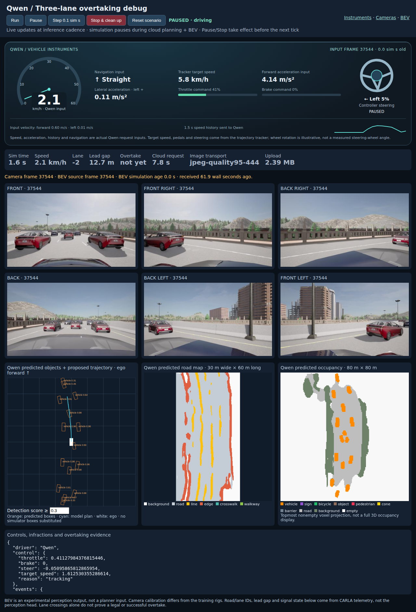

# Qwen-Drive + CARLA

Tools for testing Qwen-Drive-1.0 on an RTX 5080 with 16 GB VRAM, starting with
offline prediction on recorded CARLA scenes. The experimental runner also supports
route-conditioned recording, shadow inference and closed-loop trajectory tracking.
Live recording and concurrent Qwen shadow inference are validated against Windows
CARLA. Experimental model-controlled motion works after a moving handover; it is
not yet a reliable general driving system.



The [dense traffic debug dashboard](docs/dense-debug.md) shows Qwen inputs,
controller commands, surround cameras and experimental BEV predictions from a
24-car, three-lane scenario. Screenshot from a paused run; it does not demonstrate
a successful overtake.

**Measured result:** reduced-resolution Qwen inference succeeds on this GPU:
11.90 GiB peak reserved VRAM and 0.83 s for the second call on the demo scene.
See [initial results and limitations](docs/initial-results.md).

**CARLA integration:** the Windows server completed a real Town01 recording,
and Qwen produced trajectories from its camera frames. See
[Windows integration results](docs/windows-integration-results.md) for the
measured behavior, installation path and reproduction commands.

**Single-GPU mode:** `--precision nf4` quantizes the language layers while keeping
vision and planning in BF16. A real Town01 shadow run used about 12.9 GiB total
GPU memory. See [quantized live results](docs/quantized-live-results.md).

## Machine and installation

The initial machine is WSL2 / Ubuntu 24.04, Python 3.12, about 45 GiB RAM and
861 GB free disk before setup. CUDA and a BF16 matrix multiplication work on the
RTX 5080. **Vulkan currently exposes only llvmpipe (CPU rendering)** in this WSL
installation. Use a **Windows CARLA server with the Python client in WSL**.
CUDA working does not establish that Unreal's Vulkan rendering works.

From the repo root, with `uv` and Git available:

```bash
bash scripts/setup.sh
.venv/bin/python scripts/download_model.py
.venv-qwen/bin/drive-check --torch --output outputs/environment-qwen.json
```

The environments are separate: `.venv` contains the CARLA 0.9.16 client and tests;
`.venv-qwen` contains the model runtime. Model weights (~11 GB), upstream source,
recordings, environments, and outputs are ignored by Git. Source and model
revisions are pinned in the setup/download scripts. `requirements-qwen.txt`
captures the installed SDPA runtime; native FlashAttention, causal-conv1d and
flash-linear-attention extensions are not installed. The system's `nvcc` is
12.0; PyTorch carries its own newer CUDA runtime. Do not equate those versions.

The official model recommends 24 GB+ VRAM. This repo offers an experimental NF4
profile for concurrent CARLA use on 16 GB; CPU offloading is not implemented.

## Standalone model benchmark

Run with CARLA stopped:

```bash
.venv-qwen/bin/drive-benchmark --output outputs/demo-small --runs 2
# Optional low-memory comparison on the same input:
.venv-qwen/bin/drive-benchmark --precision nf4 --output outputs/demo-nf4 --runs 2
```

Uses the upstream demo, BF16, SFT direct planning, SDPA, and one trajectory sample.
`small` explicitly resizes each view's history to 320×192 and current image to
640×384. This preserves three views and four timestamps but changes the original
benchmark inputs. `--image-profile native` retains upstream preprocessing and may
need more VRAM. Reducing resolution can reduce driving accuracy.

Each fresh output directory contains `report.json` (cold/warm latency, allocated
and reserved CUDA peaks, configuration, failure stage if any), predictions as
`trajectories_*.npy`, and `trajectory.png` on success. CUDA peaks describe this
PyTorch process, not total GPU usage by Windows and other applications. The
benchmark refuses an existing output directory to avoid overwriting a run.

## CARLA on Windows

Download and extract the **Windows CARLA 0.9.16** package from the
[official release](https://github.com/carla-simulator/carla/releases/tag/0.9.16).
Run in PowerShell (substitute the extracted directory):

```powershell
C:\CARLA_0.9.16\CarlaUE4.exe -RenderOffScreen -quality-level=Low -nosound
```

Alternatively use `scripts/start_carla_windows.ps1 -CarlaRoot C:\CARLA_0.9.16`.
Off-screen rendering still supplies camera images; **no-rendering mode does not**.
Low quality is for initial feasibility and changes the images the model sees.

In WSL, mirrored networking can use `127.0.0.1`; with default NAT networking,
use the Windows host address shown by `ip route show default` (the address after
`via`). Pass it explicitly below. CARLA's RPC and streaming ports (2000 and 2001)
must be reachable through Windows Firewall. Do not disable the firewall globally.

```bash
.venv/bin/drive-record --host WINDOWS_HOST_IP --seconds 10 \
  --command straight --output outputs/drive-001
```

The recorder requires a dedicated server, verifies client/server version equality,
enables synchronous 10 Hz simulation with physics substeps, and spawns a Tesla
Model 3 with three 640×384 RGB cameras. Camera yaw angles are 0°, −60°, +60° and
FOV is 90°: these are prototype mounts, not a reproduction of the training rig.
It matches camera frame IDs and timestamps to snapshots, converts BGRA to RGB,
and writes PNGs, `frames.jsonl`, and `metadata.json`. On exit it destroys its
actors and restores world settings; interrupted recordings are marked incomplete.

Traffic Manager drives the vehicle. `--command` is a **fixed model intent**, not
a route plan or a label inferred from the vehicle's future. Pick a corresponding
short road segment; predictions and autopilot may otherwise pursue different
routes. Dynamic route commands and full evaluation metrics are future work.

## Offline prediction on a recording

Stop CARLA to free GPU memory, then:

```bash
.venv-qwen/bin/drive-benchmark --recording outputs/drive-001 --index 30 \
  --output outputs/drive-001-prediction
```

The adapter uses 16 consecutive 10 Hz states, selects camera frames at
−1.5/−1.0/−0.5/0 seconds, and transforms positions, velocities, accelerations and
headings into the current ego frame (X forward, Y left, radians). It needs only
past/current observations for inference. Any recorded future is used solely as
a plot reference; a different autopilot route is not ground-truth model error.
Flat-road planar geometry is assumed for this first version.

## Validation

```bash
.venv/bin/python -m pytest -q
```

Tests cover coordinate handedness, rotated ego frames, wrapped headings,
history timing and camera sampling, missing/non-finite state, and sensor queues.
Live recording still requires a reachable CARLA server.

## Route-aware and closed-loop runs

See [live runner instructions](docs/live-runner.md) for endpoint selection, all
three modes, controls, episode logs and current limits. Existing installations
can refresh the tools with `bash scripts/setup.sh`. This adds the CARLA client to
the Qwen environment and downloads only the official routing helper source files.

```bash
# List map spawn indices without changing the simulation.
.venv/bin/drive-run --host WINDOWS_HOST_IP --list-spawns

# Capture a planned route without loading Qwen; suitable for the single-GPU setup.
.venv/bin/drive-run --host WINDOWS_HOST_IP --mode record \
  --spawn-index 0 --destination-index 10 --output outputs/route-record-001
```

The listed indices are examples, not a validated route for every map. Select a
short route that does not require a lane change. Stop CARLA, then use
`drive-benchmark --recording outputs/route-record-001` for offline predictions.

## References

- [Qwen-Drive code and input contract](https://github.com/QwenLM/Qwen-Drive-1.0)
- [CARLA synchronization](https://carla.readthedocs.io/en/0.9.16/adv_synchrony_timestep/)
- [CARLA rendering modes](https://carla.readthedocs.io/en/0.9.16/adv_rendering_options/)
- [WSL Windows/ Linux networking](https://learn.microsoft.com/en-us/windows/wsl/networking)

## Junctions, traffic and weather

The [scenario suite](docs/scenario-testing.md) adds left/right turns, seeded
nearby traffic, wet weather, matching autopilot references and video replays:

```bash
.venv-qwen/bin/python scripts/run_scenarios.py --host WINDOWS_HOST_IP \
  --output outputs/junction-suite-NEW --reference --follow-camera --replays --seconds 45
```

## Remote GPU inference

Qwen can run as a separate GPU service while the lightweight local controller
connects to Windows CARLA. Use `drive-run --planner-url http://127.0.0.1:8765`
through an SSH tunnel. See [Google Cloud deployment and connection](docs/remote-inference.md).

The [quality profile](docs/quality-profile.md) offers cloud BF16 planning and optional RL reasoning,
1280×768 local cameras, and Epic CARLA rendering on the RTX 5080.

The [BEV perception path](docs/bev-perception.md) captures six calibrated surround
cameras and runs Qwen's official object, occupancy and map heads on the L4.
These are experimental perception outputs, separate from the driving planner.

The [dense overtaking debug scenario](docs/dense-debug.md) adds a genuine
three-lane road with 24 cars and a live camera/BEV dashboard with pause and step controls.
