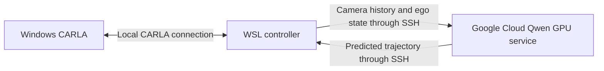

# Qwen on Google Cloud, CARLA on your Windows PC

The GPU model runs on the VM. A lightweight Python client in local WSL owns
CARLA ticks, camera capture, routing and trajectory tracking. It sends 16 ego
states and 12 lossless PNG camera images per query through an SSH tunnel and
receives 50 ego-frame XY/heading waypoints. CARLA RPC and sensor ports remain
local. This is synchronous experimentation: cloud inference and network latency
pause simulation time, so the result is not a real-time driving system.



The service binds to `127.0.0.1:8765` only. SSH provides authentication and
encryption; the HTTP service is for that tunnel and is not a public API. The
client accepts only loopback HTTP URLs. No router port forwarding or public
CARLA firewall rule is needed. Requests are serialized, size bounded and
matched by unique request ID and frame token. There is no automatic retry of
an uncertain inference request. Errors and timeouts propagate to the existing
local braking/cleanup path; the client owns synchronous ticks throughout.
The protocol assumes trusted users on the VM and local machine.

The current recommended service is the [quality profile](quality-profile.md):
BF16 planning and larger camera inputs, with an optional RL reasoning profile. The NF4 instructions below describe
the earlier baseline and remain useful for comparison.

## Existing VM deployment

The selected VM is `instance-20260830-001452`, zone `us-central1-a`, project
`idyllic-silo-475917-h4`. Its inspected configuration is Ubuntu 24.04,
`g2-standard-32`, one NVIDIA L4, driver 580.173.02 (CUDA 13.0 support), and a
500 GB boot disk. The GPU is suitable for testing this CUDA/BF16/NF4 profile.
The scripts do not create, resize, start or stop the VM.

After `gcloud auth login`, from this repository:

```bash
bash scripts/deploy_gcp.sh idyllic-silo-475917-h4 us-central1-a instance-20260830-001452
```

This uploads source into a new timestamped release directory and creates
isolated Python environments. It installs pinned dependencies and downloads
the pinned public Qwen weights on the VM. It does not copy local simulator
recordings, credentials, Windows CARLA or existing virtual environments.
System Python needs `venv`; the VM also needs git, an NVIDIA driver compatible
with the pinned CUDA 13 build, network access and adequate storage. Existing VM
environments and workloads are not modified. Inspect GPU usage before starting
another model if the VM is shared.

Use the release directory printed by deployment to start the service in a
persistent SSH/tmux session on the VM:

```bash
cd ~/RELEASE_DIRECTORY
.venv-qwen/bin/python -m qwen_drive_carla.remote --precision nf4 --port 8765
```

The L4 has more VRAM than the local 5080, and CARLA rendering remains local.
NF4 is retained initially for comparison with the tested local configuration.
BF16 is available with `--precision bf16`, but needs a separate comparison run.
The service chooses model precision; local `drive-run --precision` does not
change a remote model.

The installed release is `/home/yfrl/qwen-drive-20260919T050311Z-2343929`.
Its service is running in tmux session `qwen-drive-agent`. To start it again
on the VM after stopping it:

```bash
cd ~/qwen-drive-20260919T050311Z-2343929
bash scripts/start_remote_service.sh
```

Inspect with `tail -f service.log`. Stop it with
`tmux send-keys -t qwen-drive-agent C-c` on the VM.

## Local tunnel and driving

Keep this command running in a WSL terminal:

```bash
bash scripts/tunnel_gcp.sh idyllic-silo-475917-h4 us-central1-a instance-20260830-001452
```

The tunnel forwards WSL `127.0.0.1:8765` to the VM's loopback service port.
Set `GCP_IAP=1` for either deployment or tunnelling when the VM requires IAP;
the script assumes the necessary IAM and SSH firewall access already exist.

Start Windows CARLA as usual, then run the local controller in the lightweight
`.venv` (no local torch/GPU inference required):

```bash
.venv/bin/drive-run --host WINDOWS_HOST_IP \
  --planner-url http://127.0.0.1:8765 --planner-timeout 120 \
  --mode closed-loop --warmup-driver autopilot \
  --spawn-index 11 --destination-index 153 --seconds 45 --max-speed 4 \
  --follow-camera --output outputs/cloud-right-turn-NEW
```

Those indices require Town01. Use shadow mode first for a new model/configuration.
The cloud service must already report ready; model loading happens before it
opens the port. A tunnel being open alone does not prove the service is ready.

For a recorded-data check without a running simulator:

```bash
.venv/bin/python scripts/smoke_remote.py \
  --recording outputs/windows-carla/record-002 --index 30 \
  --output outputs/cloud-smoke-NEW
```

Metrics include total client-side planning time, server inference time and
request bytes. The local real-model transport smoke test sent approximately
4.57 MB per request with the current lossless image settings. Internet upload
speed will affect wall-clock throughput. The local loopback timing is not a
cloud latency estimate.

## Verification and operations

Transport tests open real loopback sockets, so restrictive sandboxes need
network permission to run them. Tests cover lossless pixels/state, request/frame
matching, malformed input, rejected requests releasing the service lock, and
server errors. Local controller tests separately verify braking on planner errors.

Stop the local driving client first so it releases actors, then close the SSH
tunnel and stop the remote service. Leaving the VM running continues to incur
its usual Google Cloud costs; stopping the inference process does not stop VM
billing. The deployment scripts do not change VM power state.

References: [Google GPU machine families](https://docs.cloud.google.com/compute/docs/gpus),
[SSH through IAP](https://docs.cloud.google.com/compute/docs/connect/ssh-using-iap).

The scenario suite can also use the cloud service from the lightweight environment:

```bash
.venv/bin/python scripts/run_scenarios.py --host WINDOWS_HOST_IP \
  --planner-url http://127.0.0.1:8765 --reference --follow-camera --replays \
  --seconds 45 --output outputs/cloud-junctions-NEW
```

The deployment and live driving connection have been verified; see
[cloud validation results](cloud-results.md) for measured latency and outcomes.
