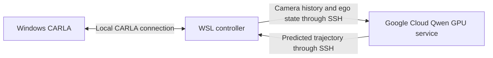

# Qwen on Google Cloud, CARLA on your Windows PC

The GPU model runs on the VM. A lightweight Python client in local WSL owns
CARLA ticks, camera capture, routing and trajectory tracking. It sends 16 ego
states and 12 lossless PNG camera images per query through an SSH tunnel and
receives 50 ego-frame XY/heading waypoints. CARLA RPC and sensor ports remain
local. This is synchronous experimentation: cloud inference and network latency
pause simulation time, so the result is not a real-time driving system.


```mermaid
flowchart LR
    CARLA[Windows CARLA] <-->|Local CARLA connection| Runner[WSL controller]
    Runner -->|Camera history and ego state through SSH| Qwen[Google Cloud Qwen GPU service]
    Qwen -->|Predicted trajectory through SSH| Runner
```

The service binds to `127.0.0.1:8765` only. SSH provides authentication and
encryption; the HTTP service is for that tunnel and is not a public API. The
client accepts only loopback HTTP URLs. No router port forwarding or public
CARLA firewall rule is needed. Requests are serialized, size bounded and
matched by unique request ID and frame token. There is no automatic retry of
an uncertain inference request. Errors and timeouts propagate to the existing
local braking/cleanup path; the client owns synchronous ticks throughout.
The protocol assumes trusted users on the VM and local machine.

The current recommended service is the [quality profile](quality-profile.md):
BF16 planning and larger camera inputs, with an optional RL reasoning profile. The NF4 instructions below describe
the earlier baseline and remain useful for comparison.

## Existing VM deployment

The selected VM is `instance-20260830-001452`, zone `us-central1-a`, project
`idyllic-silo-475917-h4`. Its inspected configuration is Ubuntu 24.04,
`g2-standard-32`, one NVIDIA L4, driver 580.173.02 (CUDA 13.0 support), and a
500 GB boot disk. The GPU is suitable for testing this CUDA/BF16/NF4 profile.
The scripts do not create, resize, start or stop the VM.

After `gcloud auth login`, from this repository:

```bash
bash scripts/deploy_gcp.sh idyllic-silo-475917-h4 us-central1-a instance-20260830-001452
```

This uploads source into a new timestamped release directory and creates
isolated Python environments. It installs pinned dependencies and downloads
the pinned public Qwen weights on the VM. It does not copy local simulator
recordings, credentials, Windows CARLA or existing virtual environments.
System Python needs `venv`; the VM also needs git, an NVIDIA driver compatible
with the pinned CUDA 13 build, network access and adequate storage. Existing VM
environments and workloads are not modified. Inspect GPU usage before starting
another model if the VM is shared.

Use the release directory printed by deployment to start the service in a
persistent SSH/tmux session on the VM:

```bash
cd ~/RELEASE_DIRECTORY
.venv-qwen/bin/python -m qwen_drive_carla.remote --precision nf4 --port 8765
```

The L4 has more VRAM than the local 5080, and CARLA rendering remains local.
NF4 is retained initially for comparison with the tested local configuration.
BF16 is available with `--precision bf16`, but needs a separate comparison run.
The service chooses model precision; local `drive-run --precision` does not
change a remote model.

The installed release is `/home/yfrl/qwen-drive-20260919T050311Z-2343929`.
Its service is running in tmux session `qwen-drive-agent`. To start it again
on the VM after stopping it:

```bash
cd ~/qwen-drive-20260919T050311Z-2343929
bash scripts/start_remote_service.sh
```

Inspect with `tail -f service.log`. Stop it with
`tmux send-keys -t qwen-drive-agent C-c` on the VM.

## York cheddar0 (GH200) deployment

`cheddar0` (`~/.ssh/config` host, reached via the `york` jump host) has one
NVIDIA GH200 480GB (97.9 GB HBM), 72 Grace cores, Ubuntu 24.04 and **aarch64**
Python 3.12. CARLA publishes no aarch64 client wheels, so `scripts/setup.sh`
skips the `carla` package on non-x86_64 hosts. The host only serves the model;
CARLA and the controller stay on the Windows/WSL machine as before. The machine
is shared: check `nvidia-smi` before starting a service.

```bash
bash scripts/deploy_ssh.sh cheddar0          # rsync source, set up envs, download weights
ssh cheddar0 'cd ~/RELEASE_DIRECTORY && bash scripts/start_remote_service.sh quality'
bash scripts/tunnel_ssh.sh cheddar0          # keep running; forwards 127.0.0.1:8765
```

The tunnel replaces `tunnel_gcp.sh`; every `--planner-url http://127.0.0.1:8765`
command below works unchanged. The 2026-10-02 release is
`/home/dais/qwen-drive-20261002T081854Z-803545` (tmux session `qwen-drive-agent`).
All 128 tests pass there. The `debug` (BEV) profile has not been set up on
cheddar0: `setup_bev_cloud.sh` pins x86 CUDA 12.9 / sm_89 settings.

Recorded-scene smoke test (`record-002`, index 30, quality profile, BF16 SFT
direct, high inputs, 4.57 MB request):

| Request | Client total | Server GPU inference |
| --- | ---: | ---: |
| Cold | 7.36 s | 6.22 s |
| Warm | 3.40 s | 2.47 s |

Peak reserved CUDA memory was 15.8 GB. For comparison, the L4 live quality run
averaged 3.75 s server inference ([quality results](quality-results.md)); that
is a live-episode mean, not the same single-scene measurement. The runtime is
still SDPA without FlashAttention or other native kernels.

Live Town01 episode (`outputs/cheddar0-live-001`), same route and settings as
the L4 quality run (spawn 2 → 133, 25 s, 3 m/s cap, high cameras, Epic):

| Metric | cheddar0 GH200 | L4 quality run |
| --- | ---: | ---: |
| Outcome | Time limit, 74% progress | Completed |
| Distance (model-driven) | 28.36 m (25.41 m) | 32.02 m |
| Collisions / lane invasions / rejected plans | 0 / 2 / 0 | 0 / 0 / 0 |
| Mean client planning time | 3.30 s | 6.48 s (warm) |
| Mean server inference | 1.79 s | 3.75 s |
| Wall-clock | 305.9 s for 25 sim s | 356.49 s for 19.9 sim s |

Shortly after handover the model's trajectories slowed the car to a stop for
about 9 simulation seconds with no traffic light or nearby vehicle, after which
it resumed. That stall, not latency, caused the time limit. One episode does not
show whether GH200 numerics differ from the L4 run; the planner is sampled.

The `reasoning` profile (BF16 RL expert, reasoning mode) on the same route
(`outputs/cheddar0-reasoning-001`) averaged 4.56 s client / 2.99 s server per
plan (L4: 7.76 s client). It reached only 21% progress (7.51 m, 4.56 m
model-driven), with no collisions, lane invasions or rejected plans, while every
reasoning string said to accelerate on a clear road.

Both stalls share one pattern. While the car was below 0.3 m/s, 17 of 20 plans
(quality) and 40 of 42 (reasoning) moved less than 0.3 m in the first 0.5 s but
more than 5 m by 5 s: hold, then go. `TrajectoryTracker.step` (`src/qwen_drive_carla/controller.py`) sets the target
speed from the three waypoints at the current plan age, and replanning every
0.5 s means only the first few waypoints are ever used. Target speed stays below
or near the 0.15 m/s stop threshold, so the car never leaves the "hold" segment.

Fix: below `launch_speed` (0.5 m/s) the tracker uses the larger of the
near-term target and the mean planned speed over `launch_window` (2 s).
Replaying the 62 stopped-state plans above raised the median target from
0.15 / 0.22 m/s to 0.95 / 0.97 m/s. A plan that holds for the whole window
still stops. `drive-run` has no red-light guard, so this can launch a plan that
expects a light to change; review signals before using it on routes with lights.

Live rerun with the quality profile and the fixed tracker
(`outputs/cheddar0-launch-001`): **completed the route** in 18.2 simulation
seconds / 216.3 wall seconds, 35.11 m (32.17 m model-driven), 34 plans, 0
rejected, 0 collisions, 0 red-light events, 2 lane invasions, max deviation
1.51 m. Warm planning averaged 3.13 s client / 1.68 s server. The car briefly
stopped after handover (4 ticks below 0.1 m/s) and then pulled away.

### Fast linear-attention kernels on cheddar0

24 of the 32 Qwen3.5 language layers are gated delta-net (linear attention).
Without `flash-linear-attention` and `causal-conv1d`, transformers runs them
with a pure-PyTorch fallback. `setup_cloud.sh` now installs
`flash-linear-attention==0.5.2` (Triton only, no compiler; `QWEN_FLA=0` skips
it). `causal-conv1d==1.7.0` was also built on cheddar0 (9 min):

```bash
export PATH=/usr/local/cuda-13.2/bin:$PATH CUDA_HOME=/usr/local/cuda-13.2 TORCH_CUDA_ARCH_LIST=9.0 MAX_JOBS=16
uv pip install --python .venv-qwen/bin/python ninja packaging wheel setuptools
uv pip install --python .venv-qwen/bin/python --no-build-isolation causal-conv1d
```

Recorded-scene smoke test (`record-002` index 30, quality profile), warm
requests:

| Kernels | Server GPU inference | Client total |
| --- | ---: | ---: |
| PyTorch fallback (4 runs) | 1.69–1.79 s | — |
| + flash-linear-attention (4 warm) | 0.75–0.77 s | — |
| + causal-conv1d (4 warm) | 0.73–0.75 s | 1.91 s |

The first request after a fresh install took 34 s (Triton compilation); with
the kernel cache populated, a restarted service's first request took 2.4 s.
Repeated requests are deterministic within each configuration. Across kernel
configurations the trajectory differs by at most 0.65 m at any waypoint, with
the same endpoint (52.85 m ahead), consistent with BF16 numerical differences.
`causal-conv1d` adds little; `flash-linear-attention` provides the gain.

Live rerun (`outputs/cheddar0-kernels-live-001`, same route and fixed tracker):
completed the route, 35.15 m, 42 plans, 0 rejected, 0 collisions, 0 red-light
events, 2 lane invasions. Per plan: 0.72 s GPU inference, 1.45 s server
request, 2.62 s client total (previously 1.68 / 1.97 / 3.13 s). Wall time was
253 s for 22.6 simulation seconds; about 110 s of that was planning, so most
remaining wall time is CARLA ticking, Epic rendering and camera capture.

## Local tunnel and driving

Keep this command running in a WSL terminal:

```bash
bash scripts/tunnel_gcp.sh idyllic-silo-475917-h4 us-central1-a instance-20260830-001452
```

The tunnel forwards WSL `127.0.0.1:8765` to the VM's loopback service port.
Set `GCP_IAP=1` for either deployment or tunnelling when the VM requires IAP;
the script assumes the necessary IAM and SSH firewall access already exist.

Start Windows CARLA as usual, then run the local controller in the lightweight
`.venv` (no local torch/GPU inference required):

```bash
.venv/bin/drive-run --host WINDOWS_HOST_IP \
  --planner-url http://127.0.0.1:8765 --planner-timeout 120 \
  --mode closed-loop --warmup-driver autopilot \
  --spawn-index 11 --destination-index 153 --seconds 45 --max-speed 4 \
  --follow-camera --output outputs/cloud-right-turn-NEW
```

Those indices require Town01. Use shadow mode first for a new model/configuration.
The cloud service must already report ready; model loading happens before it
opens the port. A tunnel being open alone does not prove the service is ready.

For a recorded-data check without a running simulator:

```bash
.venv/bin/python scripts/smoke_remote.py \
  --recording outputs/windows-carla/record-002 --index 30 \
  --output outputs/cloud-smoke-NEW
```

Metrics include total client-side planning time, server inference time and
request bytes. The local real-model transport smoke test sent approximately
4.57 MB per request with the current lossless image settings. Internet upload
speed will affect wall-clock throughput. The local loopback timing is not a
cloud latency estimate.

## Verification and operations

Transport tests open real loopback sockets, so restrictive sandboxes need
network permission to run them. Tests cover lossless pixels/state, request/frame
matching, malformed input, rejected requests releasing the service lock, and
server errors. Local controller tests separately verify braking on planner errors.

Stop the local driving client first so it releases actors, then close the SSH
tunnel and stop the remote service. Leaving the VM running continues to incur
its usual Google Cloud costs; stopping the inference process does not stop VM
billing. The deployment scripts do not change VM power state.

References: [Google GPU machine families](https://docs.cloud.google.com/compute/docs/gpus),
[SSH through IAP](https://docs.cloud.google.com/compute/docs/connect/ssh-using-iap).

The scenario suite can also use the cloud service from the lightweight environment:

```bash
.venv/bin/python scripts/run_scenarios.py --host WINDOWS_HOST_IP \
  --planner-url http://127.0.0.1:8765 --reference --follow-camera --replays \
  --seconds 45 --output outputs/cloud-junctions-NEW
```

The deployment and live driving connection have been verified; see
[cloud validation results](cloud-results.md) for measured latency and outcomes.
